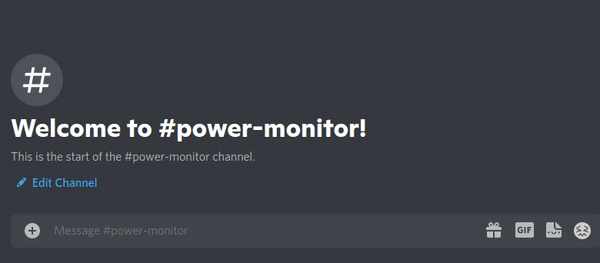

# Power Monitor

### What is it?

It's a discord bot that gets the stock levels for a specific product on power.dk

### How did I build it?

Analyzed the network traffic on power.dk and replicated a specific GET request that the client sends to the server 

### How can I use it?

DM me and I will drop you a link to where you can add the bot to your discord server!
